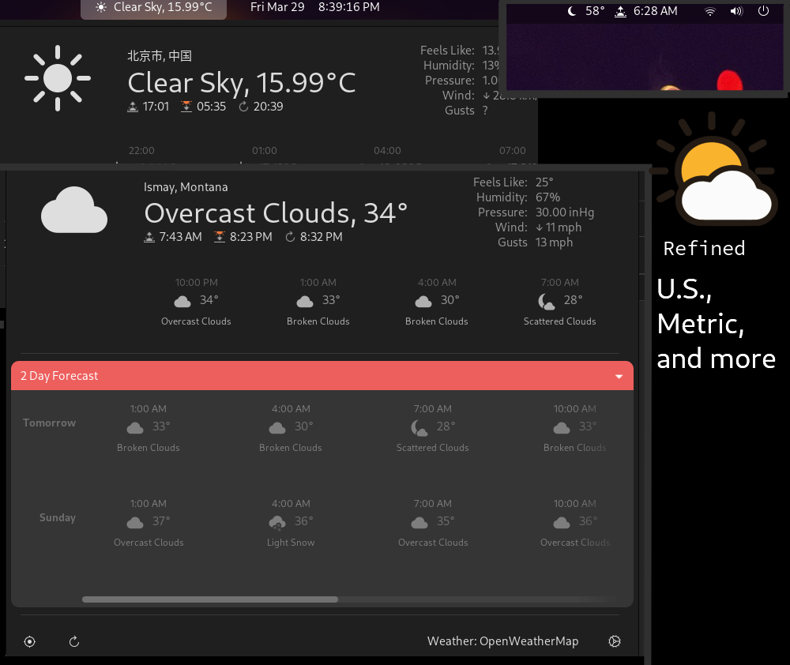

# OpenWeather Refined

[](./openweather-screenshot.png)

OpenWeather Refined is a simple extension for displaying weather conditions and
forecasts for any location on Earth in the GNOME Shell.

The extension is very configurable and does not use GNOME Weather.

Weather data is fetched from [OpenWeatherMap](https://openweathermap.org)
including 3 hour forecasts for up to 5 days.

## What's New?

[Check out the changelog.](./CHANGELOG.md)

## Contributing

Everyone is welcome to contribute! You can contribute code, or translations
via pull requests.

Run `make help` for help on make targets and scripts useful for testing.

### Translating

Translations are super helpful because once I forked
this extension I have made a lot of UI additions, and I only speak English!

Translations can be made by editing the language's file `./po/*.po`.
Edit the `msgstr` field to the translation for the English in `msgid`.

## Installation

### GNOME Extensions Website (Recommended)

<p align="left">
  <a href="https://extensions.gnome.org/extension/6655/openweather">
    
  </a>
</p>

### Packages

If you want a package for another platform, create an [issue](https://github.com/penguin-teal/gnome-openweather/issues/new/choose).
If you make a package, let me know or make a pull request and list it below.

- Arch AUR [gnome-shell-extension-openweatherrefined](https://aur.archlinux.org/packages/gnome-shell-extension-openweatherrefined)
- Fedora Copr [gnome-shell-extension-openweatherrefined](https://copr.fedorainfracloud.org/coprs/fiftydinar/gnome-shell-extension-openweatherrefined/) by [@fiftydinar](https://github.com/fiftydinar)

### Install From Source

Tip: Once you've cloned the repo, you can run `make help` to get information
on a lot of make target and more commands that might be useful.

This method installs to your `~/.local/share/gnome-shell/extensions` directory
from the latest stable source code on the `master` branch.

First make sure you have the following dependencies installed:

| Arch-Based     | Debian-Based                  | Fedora                 |
| ---            | ---                           | ---                    |
| `dconf`        | `dconf-gsettings-backend`     | `dconf`                |
| `gnome-shell`  | `gnome-shell-extension-prefs` | `gnome-extensions-app` |
| `git`          | `git`                         | `git`                  |
| `base-devel`   | `build-essential`             | `glib2-devel`          |
|                | `gettext`                     | `gettext-devel`        |
|                | `libsoup3`                    |                        |

Run the following commands:

```shell
git clone https://github.com/penguin-teal/gnome-openweather.git

cd gnome-openweather

# This switches to the latest stable release
git switch --detach latest

make && make install
```

Restart the GNOME shell:

- X11: `Alt` + `F2`, `r`, `Enter`
- Wayland: Log out/Reboot

Now enable the extension through the *gnome-extensions* app.

## Bugs

Bugs should be reported
[here](https://github.com/penguin-teal/gnome-openweather/issues)
on the GitHub issues page.

## Credits

This project is a fork of Kenneth Topp's fork of Jason Oickle's fork of the
original OpenWeather extension by @jenslody. See [`AUTHORS`](./AUTHORS)
for previous contributor details.

### Translations

Special thanks to the following people for updating translation `*.po` files
via merge requests:

French: @franckgaga | Slovak: @jose1711 | Chinese: @xiaozhangup & @zyw271828 |
Portuguese: @ronaldocosta | Russian: @vantu5z & @tvaliiev | Czech: @lev741 |
Turkish: @oguzkarayemis | German: @zeners | Polish: @MarcinScieszka |
Italian: @alealetti

### Icons

OpenWeather's icon was designed by [Sihan Liu](https://www.sihanliu.com) and
licensed under the [CC-BY-SA](http://creativecommons.org/licenses/by-sa/3.0/)
license.

Packaged weather icons are sourced from the
[GNOME Project](http://www.gnome.org)'s
[Adwaita Icon Theme](https://gitlab.gnome.org/GNOME/adwaita-icon-theme)
under the GPLv3 license.

### License

OpenWeather is free software available under the terms of the GPLv3 license.
See [`COPYING`](./COPYING) for details.

